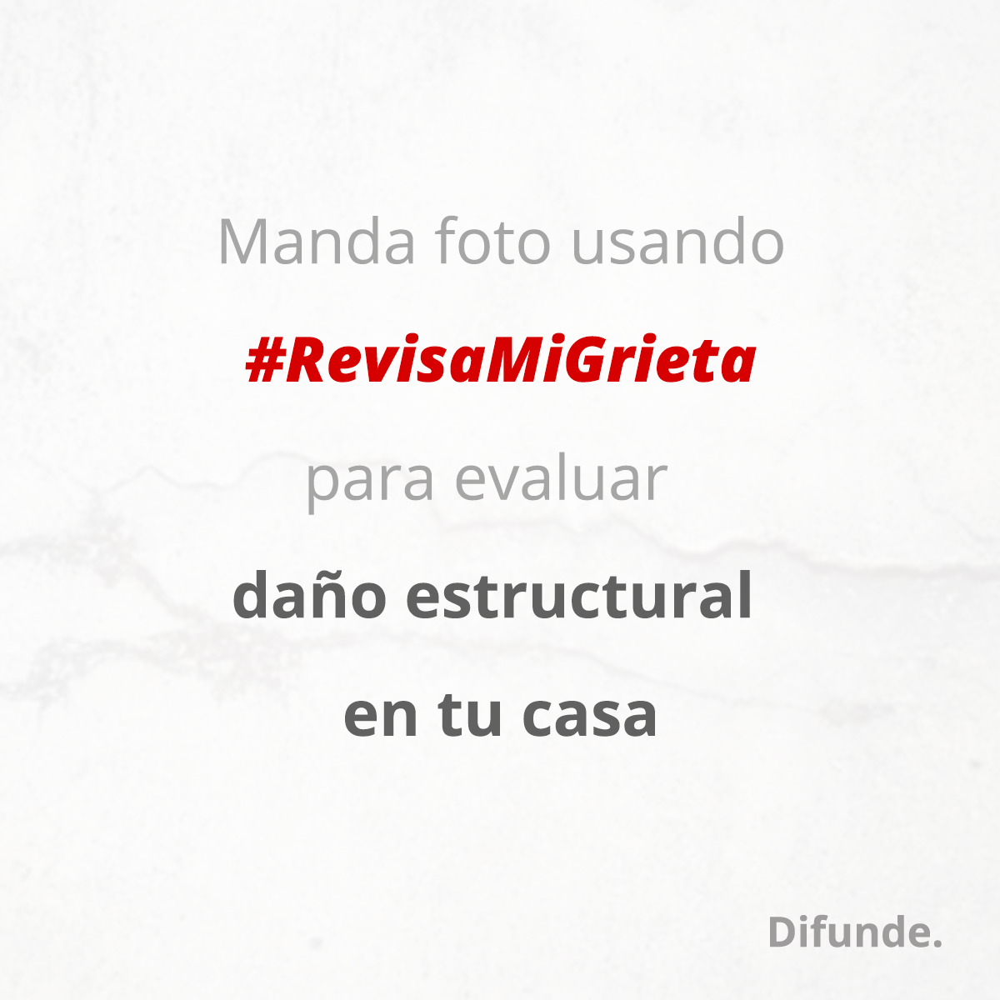

# Bot de @RevisaMiGrieta (Alpha)

Proyecto para atender alguna de las necesidades después del SismoMX del 19 de Septiembre de 2017.
El bot está diseñado para trabajar con la API de Twitter.

## Dependencias:

El proyecto fue creado con Python 3.6
- ChatterBot
- twitter
- SQLAlchemy

Instala las dependencias con:
```

pip install -r requirements.txt
```

## Corpora
Archivo utilizado para entrenar el bot con las frases a las que debe de responder.
Revisa [corpora.py](./corpora.py) y agrega las preguntas y sus correspondientes respuestas.

## Contribuye
Revisa los [issues](https://github.com/codersmexico/revisa-mi-grieta-bot/issues) y manda Pull Request.

## Team
 - [Poguez](http://noedominguez.com)

## Licencia

Available under the license: GNU Affero General Public License (AGPL) v3.0. Read the document LICENSE for more information